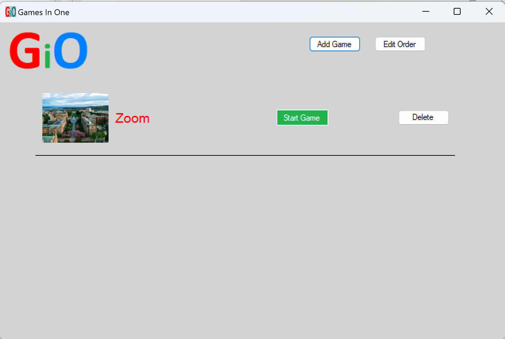
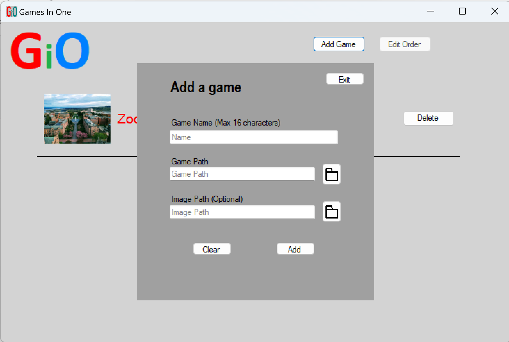
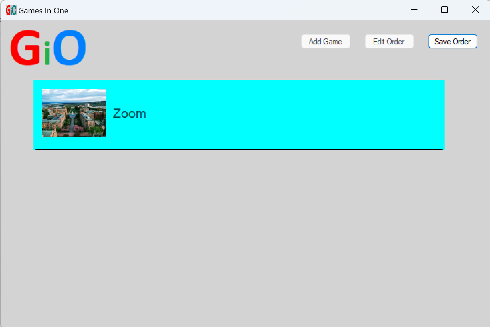

# GamesInOne
GamesInOne is a videogame catalog that keeps all of a person’s games in one place. Users can launch their games via the click of a button, even if they belong to different digital gaming platforms, all from one centralized and easy-to-use location. All that is needed is to enter the login to all their different digital platforms and enter the games desired to be cataloged (and their address on the computer). The app aims to mitigate the struggle of trying to find games on different platforms and improve ease of use for gamers so that everything is all in one place.\
\
DISCLAIMER - This app only runs on Windows machines.

## User Guide
GamesInOne allows you to add and launch executables from the convenience of one screen. As of the current release, users can add, launch, and delete executables, as well as reorder the list of added executables via the app. Users can increase productivity with this quality of life improvement to organzing and cataloging apps on their computers.

### Downloading and Installing
- You will need the .NET framework, version 4.7.2 to run the app.
  - If you do not already have it installed, download it [here](https://dotnet.microsoft.com/en-us/download/dotnet-framework/net472).
- To download the latest release of Games In One, click on the latest release in the GitHub home page for the app
  - The current latest release is named: `Version 1.1`
- Once you've been redirected to the release page, navigate to the `Assets` section, and download the zip of the executable
  - The zip you want is: `GamesInOne.zip`
- Once the zip has been downloaded, make sure to extract the package before running

### Running
To run GamesInOne, click on the `GamesInOne.exe` executable to launch the app. You can also add a shortcut to your desktop if you wish.

### Features and Usability
- To add an executable: click the `Add Game` button, and a pop-up window will open
  - The `name` field will allow you to type in any name you want displayed, and is required
  - The `path` field is the path to the executable for the app, and is required
  - The `image path` field is the path to the display image, and is optional
- To launch an executable, click the `Play` button for the desired executable
- To reorder the list click the `Edit Order` button, and you will enter editing mode
  - Click and drag executables to reorder the list
  - Click `Save Order` button to save the order and exit editing mode
- To delete and executable, click the `Delete` button next to the desired executable
\
\
This is the main page:

- The `Add Game` button is located in the top left
- The `Edit Order` button is also located in the top left
- `Start Game` and `Delete` are to the left of the game they belong to
\
\
This is the add game page:

- All fields that can be filled are located in the pop-up window
- The `Exit` button is located in the top left of the pop-up window
- The `Clear` and `Add` buttons are located at the bottom of the pop-up
\
\
This is the change order page:

- The game is highlighted blue, indicating that it can be clicked and dragged
- The `Save Order` button is located at the top left

### Reporting Bugs
To report a bug or issue, navigate to the `Issues` tab of this repo, and click `New Issue`. Please be as descriptive as possible when reporting bugs. If applicable, please provide an image that shows the issue in your bug description.

### Known Bugs
To see a list of known bugs, navigate to the `Issues` tab, which has an up-to-date list of all reported bugs in the app.

## Developer Guide
Want to contribute to the project? Here's a guide on how you can:

### Obtaining Source Code
If you want to obtain and/or make edits to the source code, you may fork the repo. If/when you want to merge your additions to the official source code, submit a pull request, and an admin will review it.

### Layout
- Artifacts, members, roles and links are in the ORG file at the top level.
- Weekly reports are located in the reports directory.
  - The report for week X is named WeekXReport.
- Functional code is located in the src directory.
- Issues list located here: https://github.com/users/asagrekin/projects/3
- READMEs with more information are located in each directory

### Building the Software
- The Back-end and database directories should have makefiles to build the code they contain
- The front-end is more complicated, please adhere to the following steps:
  - Download Visual Studio IDE https://visualstudio.microsoft.com/vs/ 
  - WHEN INSTALLING, MAKE SURE THAT THE `Desktop development With C++` BOX AND THE `.NET desktop development` BOX ARE BOTH CHECKED. (This contains MSBuild, and .NET build tools).
  - If you already of Visual Studio installed, in the Visual Studio installer, click `Modify` by the 2022 community edition, and checking the `Desktop development With C++` and `.NET desktop development` boxes before clicking `Modify` again.
  - Open up the solution file located at `/src/front-end/front-end-interface/GamesInOne.sln` using Visual Studio IDE.
  - Right click the solution and hit `Build` to build the solution, and click `Start` at the top of the IDE to start the app for debugging.

### Running Back-End & Database Tests
In order to make use of the Google Test Suite for C++ you will need to have CMake installed on your device which you can do here: https://cmake.org/. For additional information on the proccess of setting up CMAKE you may find it useful to reference the Google Test homepage which can be found here: https://google.github.io/googletest/quickstart-cmake.html.

Once CMake is installed please start by reading the guiding comments within the backend_testing.cc file, This file can be located within the backend folder inside the main source code. The reason for reading and understand these tests is that the tests themselves rely on certain file paths to exist which may not exist on your local computer and will require some small changes to be made. Once you're done reading, cd into the backend folder. Then run the following commands to do an initial test that contains setup commands.\
`cmake -S . -B build`                                                                      
`cmake --build build`\
`cd build`\
`mkdir dbFiles`\
`New-Item -ItemType File -Path "dbFiles\ind.dat"`\
`New-Item -ItemType File -Path "dbFiles\lst.dat"`\
`ctest`

After this is completed you can just run the following commands below to continue testing in the future. Keep in mind that after every testing run you execute you will be put into the build folder so you will need to cd out of this back into the backend folder before testing again.\
`cmake -S . -B build`                                                                      
`cmake --build build`\
`cd build`\
`ctest`\
\
***If you do not wish to manually run the tests, they will automatically be run by the CI whenever a push is made.***

### Adding Back-End and Database Tests
The tests are located in `src/backend/backend_testing.cc`.\
Read the Google Test documentation for more detail on implementing tests here: https://google.github.io/googletest/

### Running Front-End Tests
The best way to test the front end is using the Visual Studio IDE. \
Opening the solution file (`/src/front-end/front-end-interface/GamesInOne.sln`) in Visual Studio, you will see that the FrontEndTest project is listed in the Solution Explorer.\
After building the solution, right click the FrontEndTest project and click `Run Tests`.\
\
***If you do not wish to manually run the tests, they will automatically be run by the CI whenever a push is made.***

### Adding Front-End Tests
The tests are located in `src/front-end/front-end-test/FrontEndUnitTest.cs`.\
In the case where you want to refer to specific private components within a User Control, to test their state, you can use Reflection.\
For example getting the GameNameTextBox from the AddGameScreen:\
`AddGameScreen addGameScreen = new AddGameScreen(main);`\
`TextBox gameNameTextBox = addGameScreen.GetType().GetField("GameNameTextBox", BindingFlags.Instance | BindingFlags.NonPublic).GetValue(addGameScreen) as TextBox;`

### Continuous Integration
There is CI in all functioning branches of the repository, which runs all of the tests for both the front and back ends. Any push will trigger the CI to run on the GitHub repo. This may take some minutes (usually about 3-4).\
\
If tests are added following the instructions under "Adding Back-End and Database Tests" or "Adding Fornt-End Tests", they will automatically be tested by the CI whenever a push is made.\
\
To add more jobs, see [documentation on adding GitHub actions](https://docs.github.com/en/actions). The yaml files are located in `.github/workflows`. Please add any new jobs you wish to run in `front-end-test.yml` or `backend-test`.\
\
The workflow that creates a release with a zip of GamesInOne upon a tag being pushed is located in `.github/workflows/release.yml`.

### Creating a New Release
In order to create a new release, simply push **new** a tag to the main repository (tag must start with v, eg: v1.0.1). This should automatically create a new release, with a `GamesInOne.zip` included. This `GamesInOne.zip` will included a runnable executable of the app, once downloaded and extracted.
